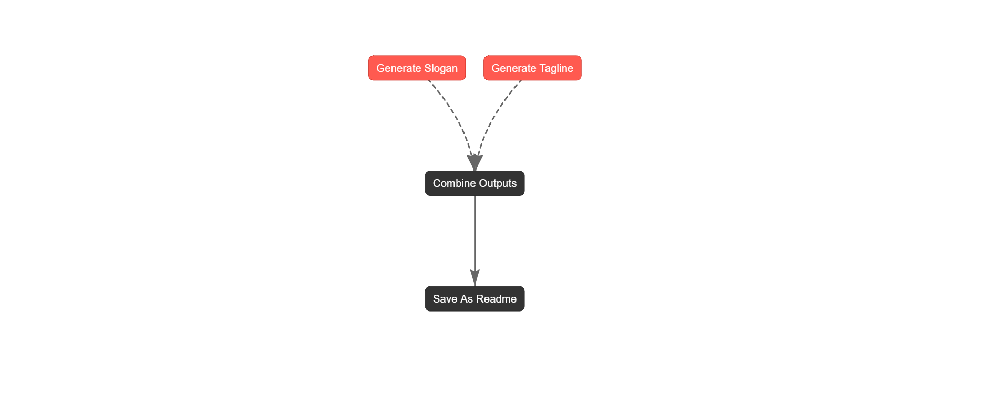

# Agent Response

# Image Generate By Plot

Combined Output: Slogan - 'Here are a few creative slogans for a futuristic brand, playing on different angles:

**Emphasizing Innovation & Progress:**

*   **Ahead of Tomorrow. Creating Today.**
*   **The Future. Engineered.**
*   **Designing What's Next.**
*   **Beyond Innovation. Beyond Expectation.**
*   **Forward. Always.**

**Focusing on Transformation & Empowerment:**

*   **Evolving Reality. Empowering You.**
*   **Transform Your World. Starting Now.**
*   **The Future is Yours. Shape It With Us.**
*   **Unlock Tomorrow. Today.**

**Highlighting Cutting-Edge Technology:**

*   **Powered by Possibility.**
*   **The Cutting Edge. Redefined.**
*   **Where Technology Meets Tomorrow.**
*   **Intuitive. Intelligent. Inevitable.**

**Short & Catchy:**

*   **Future. Optimized.**
*   **Next is Now.**
*   **Innovate. Evolve. Transcend.**
*   **Beyond. Connected.**

**Bonus - More Conceptual:**

*   **Architects of the Ascent.** (Suggests upward progress and ambition)
*   **The Resonance of Innovation.** (Implies a powerful and lasting impact)
*   **Harmonizing Humanity with Hyper-Technology.** (If the brand is about integrating advanced tech with human needs)

When choosing, consider:

*   **Brand Identity:** Does it match the brand's personality and mission?
*   **Target Audience:** Will it resonate with the people they're trying to reach?
*   **Memorability:** Is it easy to remember and repeat?

Good luck!' | Tagline - 'Here are a few creative taglines for a futuristic brand, playing on different angles:

**Focusing on Innovation & Advancement:**

*   **Beyond the Horizon. Here Now.** (Emphasizes bringing the future to the present)
*   **Engineering Tomorrow. Today.** (Highlights active creation and immediate impact)
*   **Futureproofed. By Us.** (Instills confidence and reliability in future-readiness)
*   **The Next Chapter. Already Written.** (Suggests they are ahead of the curve and have solutions ready)

**Focusing on Transformation & Impact:**

*   **Evolving Reality. Enhanced Life.** (Connects progress to tangible improvements)
*   **Redefining Possible. Reimagining Everything.** (Highlights ambitious goals and a complete overhaul)
*   **Powering Progress. Connecting Tomorrow.** (Implies enabling growth and building future networks)
*   **Where Innovation Meets Impact.** (Simple, direct, and highlights the practical application)

**Focusing on Simplicity & User Experience:**

*   **The Future. Simplified.** (Emphasizes ease of use and accessibility)
*   **Intuitive. Intelligent. Future.** (Highlights user-friendly design and advanced technology)
*   **Seamlessly Future.** (Focuses on a smooth and integrated experience)

**More Evocative & Mysterious:**

*   **The Architects of Tomorrow.** (Positions them as visionaries and builders)
*   **Unlock the Singularity.** (More bold and implies technological advancement)
*   **Beyond Evolution.** (Hints at a transformative leap beyond current limitations)

**To Choose the Best Tagline:**

Consider:

*   **Your Brand's Specific Focus:** Is it about innovation, impact, ease of use, or something else?
*   **Your Target Audience:** What kind of language and imagery will resonate with them?
*   **Your Brand's Voice:** Is it serious, playful, bold, or understated?

I hope these provide a good starting point! Good luck!'

